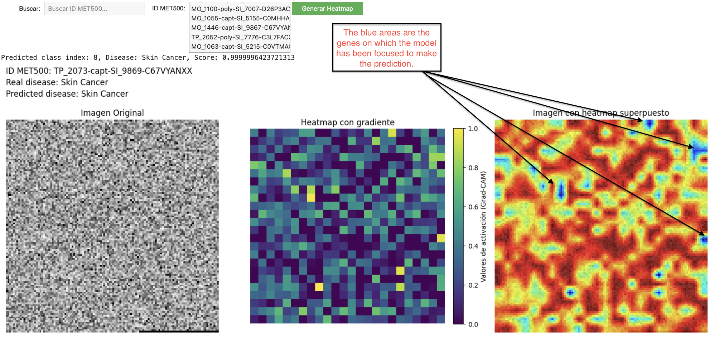
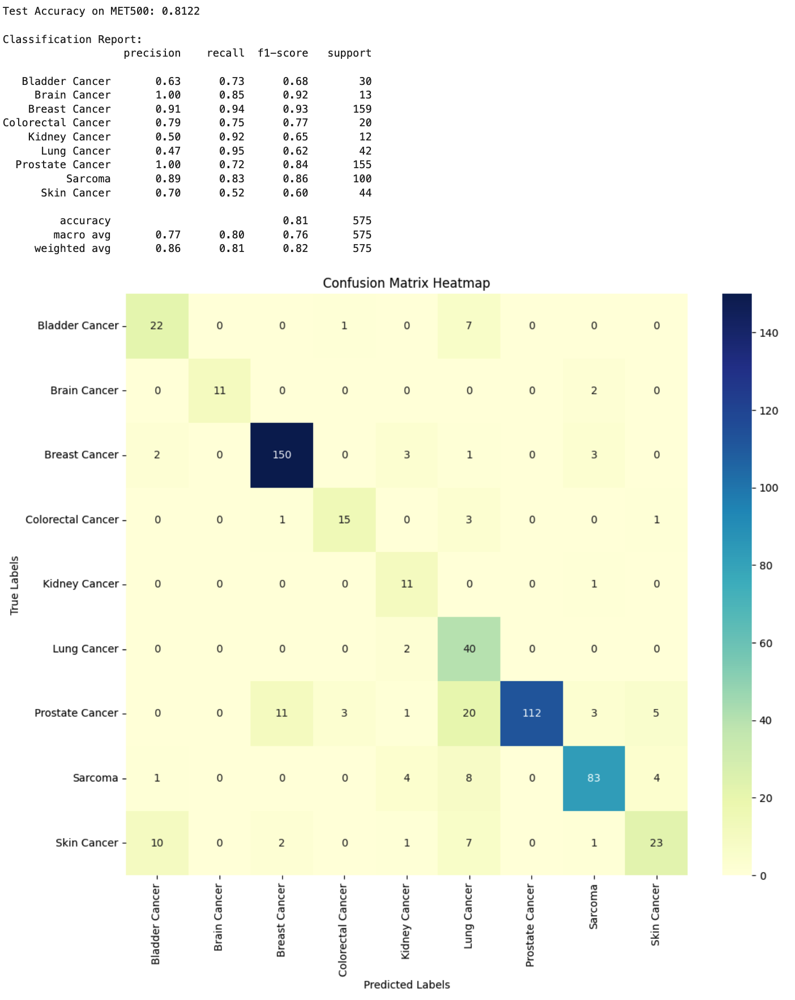
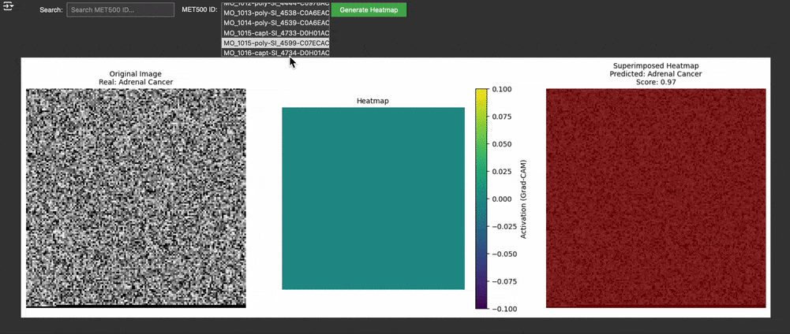

# Primary Disease Detector


[](https://colab.research.google.com/github/lusob/PrimaryDiseaseDetector/blob/main/PrimaryDiseaseDetector.ipynb)

This repository provides a TensorFlow-based pipeline for classifying the primary disease in cancer of unknown primary (CUP) cases using gene expression data from TCGA and MET500 datasets.

Additionally, there is a visualization tool (GenesScanner) that generates a heatmap superimposed on the input image, represented as a genes expression data matrix. This provides insights into how the model interprets the data for each prediction. These visualizations are particularly valuable not only for understanding the underlying biology in CUP classification but also for guiding personalized treatments in patients with any type of tumor, helping identify critical genes or gene combinations involved in specific predictions.

Unlike traditional machine learning models, which extract the most important features generically across all predictions, this approach leverages Grad-CAM visualization to highlight gene-specific contributions for each individual sample. This offers a unique capability to identify the most influential genes (or gene combinations) used by the model in predicting the disease for a specific sample.



**Why MET500 as a Test Set?**

MET500 was selected as the test set because it includes samples where the biopsy tissue is different from the tissue of origin. This subset better mimics the characteristics of CUP cases, making MET500 a more suitable dataset for evaluating the model’s performance in such challenging scenarios.

## Features

- Downloads and preprocess large datasets and phenotypes.
- Supports training a new model or using an existing pretrained model.
- Evaluates performance on the MET500 dataset using accuracy, classification reports, and confusion matrices.
- Converts gene expression data into image-like inputs for convolutional neural networks (CNNs).
- GeneScanner (Grad-CAM): Generates heatmaps to highlight the most important genes or regions of the image that contributed to the model’s predictions, specific to each individual sample.

## Repository Structure

- `data/`: Directory for datasets (downloaded dynamically if `RETRAIN_MODEL=True`).
- `model/`: Directory for saving and loading the trained model (`model/PrimaryDiseaseDetectorModel.keras`).
- `PrimaryDiseaseDetector.ipynb`: Main Jupyter Notebook.
- `README.md`: Instructions for setup and usage.

## Prerequisites

- Python 3.8 or higher
- Required Python libraries (install with `pip install -r requirements.txt`):
  - numpy
  - pandas
  - tensorflow
  - matplotlib
  - seaborn
  - sklearn
  - tqdm
  - gdown

## Dataset Preprocessing

The [TCGA](https://drive.google.com/file/d/1-6OA1Q0TqFeooVHmURcZ_F9YjRh9D2cK/view?usp=drive_link) and [MET500](https://drive.google.com/file/d/1nBzGFuq-ExWw0KC0dtagJqAOFjji8bQc/view?usp=drive_link) datasets provided in Google Drive have been preprocessed as follows:

1. **Sources:**
   - The original TCGA and MET500 datasets, both `log2(FPKM + 0.001)` normalized, were downloaded from:
     - **TCGA Gene Expression Data**: [Download](https://xenabrowser.net/datapages/?dataset=tcga_RSEM_gene_fpkm&host=https%3A%2F%2Ftoil.xenahubs.net&removeHub=https%3A%2F%2Fxena.treehouse.gi.ucsc.edu%3A443)
     - **MET500 Gene Expression Data**: [Download](https://xenabrowser.net/datapages/?dataset=MET500%2FgeneExpression%2FM.mx.log2.txt&host=https%3A%2F%2Fucscpublic.xenahubs.net&addHub=https%3A%2F%2Ftcga.xenahubs.net%3A44&removeHub=https%3A%2F%2Fxena.treehouse.gi.ucsc.edu%3A443)

2. **Steps:**
   - The datasets were intersected to include only common genes.
   - Both datasets were filtered to retain the intersected genes.

3. **Details:**
   - See the "Data Preprocessing" section in the notebook (`PrimaryDiseaseDetector.ipynb`) for the code used to generate these files.

4. **Download:**
   - The preprocessed datasets were uploaded to Google Drive and are automatically downloaded during notebook execution if `RETRAIN_MODEL=True`.

## Pretrained Model:

The pretrained model `PrimaryDiseaseDetectorModel.keras` is a convolutional neural network (CNN) designed for the classification of primary diseases in cancer cases, including Cancer of Unknown Primary (CUP). This model has been trained on the TCGA dataset and evaluated on the MET500 dataset, achieving robust performance across multiple cancer types.

### Performance Highlights:
- **Accuracy on MET500 Test Set**: 81.2%
- **Macro Average Metrics**:
  - Precision: 0.77
  - Recall: 0.80
  - F1-Score: 0.76
- **Weighted Average Metrics**:
  - Precision: 0.86
  - Recall: 0.81
  - F1-Score: 0.82

The evaluation includes eight cancer types from MET500, each represented by varying numbers of samples. These metrics highlight the model's ability to generalize across different cancers, with particularly strong performance in some classes as **Breast Cancer**, **Lung Cancer** or **Sarcoma**.

### Confusion Matrix:
The confusion matrix below illustrates the model's predictions for each cancer type in the MET500 test set. It provides insights into how well the model distinguishes between similar or overlapping classes.



- **True Labels (Y-Axis)**: The actual cancer type.
- **Predicted Labels (X-Axis)**: The model's predictions.
- **Color Intensity**: Represents the number of samples classified in each category.

### Additional Evaluations

The notebook includes two advanced evaluation scenarios for assessing the model's performance:

1. **Evaluation with an 'UNKNOWN' Category**:
   - Predictions below a confidence threshold (e.g., 0.8) are categorized as `UNKNOWN`.
   - Aimed at identifying cases where the model is uncertain about the primary cancer type.

2. **Evaluation on a CUPS Test Set**:
   - Focuses on samples where the `biopsy_tissue` differs from the expected `tissue`, simulating potential Cancer of Unknown Primary (CUPS) cases.
   - Reports classification metrics and confusion matrices for these challenging scenarios.

For a detailed implementation and results, refer to the [notebook](PrimaryDiseaseDetector.ipynb).

### Important Considerations for Clinical Application:
While the pretrained model demonstrates promising performance, **it is essential to validate the model on additional independent cohorts** before deploying it in clinical settings. This would ensure the robustness and generalizability of the model to different datasets and patient populations. 

For validation:
1. **Normalization of New Cohorts**:
   - Any new cohort must be normalized in the same way as TCGA and MET500 to ensure compatibility with the model. Specifically:
     - Expression data should be processed as `log2(FPKM + 0.001)`.
     - The resulting images must match the same dimensions and structure used during training (e.g., reshaped into square matrices with appropriate padding).
   - This ensures that the input images generated for the new cohort are consistent with those used to train the model.

2. **Testing on CUP Cohorts**:
   - Validate the model on a cohort of CUP (Cancer of Unknown Primary) cases to assess its ability to predict tumor origin in real-world clinical scenarios.

3. **Further Cohorts**:
   - Additional cohorts representing diverse populations and cancer types should be included to account for potential biological and technical variability.

### Use Cases for the Pretrained Model:
1. **Evaluation of MET500 Samples**:
   - Directly use the pretrained model to predict the primary disease for new or existing MET500 samples.
2. **Baseline for Comparisons**:
   - Provides a strong baseline for further research, allowing comparisons with other methods like Random Forest or custom models.
3. **Potential Clinical Utility**:
   - If validated on additional cohorts, the model could assist in identifying the likely primary site for CUP cases and guide treatment decisions.

### How to Use:
1. The pretrained model is automatically loaded when `RETRAIN_MODEL=False` in the notebook.
2. No additional training is required; the model is ready for inference on the MET500 test set or other compatible datasets.

This pretrained model demonstrates the potential of CNNs in classifying primary cancers based on gene expression data. However, further validation on independent cohorts is a critical step before clinical deployment to ensure reliability and reproducibility.
## Usage

### 1. Clone the repository

1. **Clone the repository:**
    ```bash
    git clone https://github.com/lusob/PrimaryDiseaseDetector.git
    cd PrimaryDiseaseDetector
    ```

### 2. Install dependencies

To install the required dependencies, run:
    ```bash
    pip install -r requirements.txt
    ```

### 3. Configure and Run the Notebook

Open `PrimaryDiseaseDetector.ipynb` and configure the variable `RETRAIN_MODEL`:

- **`RETRAIN_MODEL=True`**:
  - Downloads datasets and phenotypes from Google Drive.
  - Preprocesses the data.
  - Trains a new model and saves it in `model/PrimaryDiseaseDetectorModel.keras`.

- **`RETRAIN_MODEL=False`**:
  - Loads a pretrained model from `model/PrimaryDiseaseDetectorModel.keras`.
  - Skips data downloading and preprocessing.
  - Directly evaluates the model on the MET500 dataset.

### 4. Dataset Sources

The following large files are downloaded dynamically from Google Drive if `RETRAIN_MODEL=True`:

- **TCGA Gene Expression Data**: [Download](https://drive.google.com/file/d/1-6OA1Q0TqFeooVHmURcZ_F9YjRh9D2cK/view?usp=drive_link)
- **MET500 Gene Expression Data**: [Download](https://drive.google.com/file/d/1nBzGFuq-ExWw0KC0dtagJqAOFjji8bQc/view?usp=drive_link)
- **TCGA Phenotype Data**: [Download](https://drive.google.com/file/d/1wNXgjZMQUDqNosG_q8qZNIIq0za-ghF0/view?usp=drive_link)
- **MET500 Metadata**: [Download](https://drive.google.com/file/d/1-7yVlLwIo2aD_eojIysUllnRXb3j-b7e/view?usp=drive_link)

### 5. Results

The notebook generates:

- Model training and validation metrics.
- Accuracy, classification reports, and confusion matrices for the MET500 dataset.
- **Adjusted metrics with an 'UNKNOWN' category** for predictions with low confidence.
- **GeneScanner (Interactive Grad-CAM visualizations)** of predictions, showing heatmaps of the most important genes for each sample.

## GeneScanner: Interactive Visualization Tool

**GeneScanner** is an experimental visualization tool integrated into the `PrimaryDiseaseDetector` notebook. It aims to provide interactive Grad-CAM visualizations, allowing users to explore which genes (or combinations of genes) are most influential in the model’s predictions for individual samples. While promising, its practical utility in research and clinical applications remains to be fully validated.

### Key Features:
- **Interactive Sample Selection**: Search and select specific samples from the MET500 dataset using an intuitive interface.
- **Individualized Insights**: Highlights the gene-specific contributions used by the model for each sample, offering sample-specific interpretability.
- **Detailed Visualizations**:
  - Displays the original gene expression input image.
  - Generates a Grad-CAM heatmap showing activation levels of the most relevant genes.
  - Superimposes the heatmap on the input image for an intuitive understanding.

### How It Works:
1. Navigate to the **GeneScanner** cell in the `PrimaryDiseaseDetector.ipynb` notebook.
2. Run the cell to initialize the tool.
3. Select a sample from the MET500 dataset using the interactive search box.
4. Click the "Generate Heatmap" button to:
   - View the original input image (gene expression matrix as an image).
   - Generate a Grad-CAM heatmap highlighting important genes.
   - Visualize the heatmap superimposed on the input image.

### Demonstration:
Below is a demonstration of how GeneScanner works:




### Intended Purpose and Limitations:
GeneScanner is designed to enhance the interpretability of the model by visually linking predictions to specific gene activations. However:
- Its **utility in research and clinical applications has not yet been fully validated**.
- The tool is **experimental**, and its outputs should be interpreted with caution until further studies confirm its reliability and relevance.

### Potential Use Cases:
- **Cancer of Unknown Primary (CUP)**:
  - Identify the genes contributing to the model's classification of the primary disease.
- **General Tumor Analysis**:
  - Understand critical gene patterns across various tumor types.
- **Research and Clinical Applications**:
  - Support personalized treatment decisions by highlighting influential genes for individual patients.

**GeneScanner** bridges the gap between AI-driven predictions and their real-world interpretability, with potential applications in both research and clinical settings once validated.
