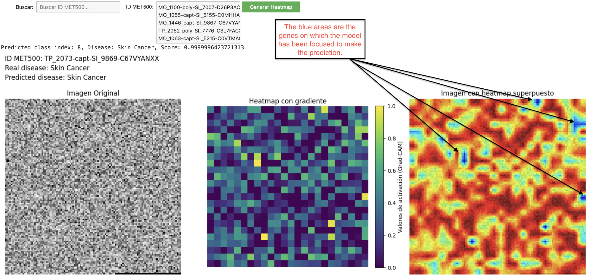

# Primary Disease Detector

[](https://colab.research.google.com/github/lusob/PrimaryDiseaseDetector/blob/main/PrimaryDiseaseDetector.ipynb)

This repository provides a TensorFlow-based pipeline for classifying the primary disease in cancer of unknown primary (CUP) cases using gene expression data from TCGA and MET500 datasets.

Additionally, there is a visualization tool (GenesScanner) that generates a heatmap superimposed on the input image, representing gene expression data of 20,000 genes. This provides insights into how the model interprets the data for each prediction. These visualizations are particularly valuable not only for understanding the underlying biology in CUP classification but also for guiding personalized treatments in patients with any type of tumor, helping identify critical genes or gene combinations involved in specific predictions.

Unlike traditional machine learning models, which extract the most important features generically across all predictions, this approach leverages Grad-CAM visualization to highlight gene-specific contributions for each individual sample. This offers a unique capability to identify the most influential genes (or gene combinations) used by the model in predicting the disease for a specific sample.



**Why MET500 as a Test Set?**

MET500 was selected as the test set because it includes samples where the biopsy tissue is different from the tissue of origin. This subset better mimics the characteristics of CUP cases, making MET500 a more suitable dataset for evaluating the model’s performance in such challenging scenarios.

## Features

- Downloads and preprocess large datasets and phenotypes.
- Supports training a new model or using an existing pretrained model.
- Evaluates performance on the MET500 dataset using accuracy, classification reports, and confusion matrices.
- Converts gene expression data into image-like inputs for convolutional neural networks (CNNs).
- GeneScanner (Grad-CAM): Generates heatmaps to highlight the most important genes or regions of the image that contributed to the model’s predictions, specific to each individual sample.

## Repository Structure

- `data/`: Directory for datasets (downloaded dynamically if `RETRAIN_MODEL=True`).
- `model/`: Directory for saving and loading the trained model (`model/PrimaryDiseaseDetectorModel.keras`).
- `PrimaryDiseaseDetector.ipynb`: Main Jupyter Notebook.
- `README.md`: Instructions for setup and usage.

## Prerequisites

- Python 3.8 or higher
- Required Python libraries (install with `pip install -r requirements.txt`):
  - numpy
  - pandas
  - tensorflow
  - matplotlib
  - seaborn
  - sklearn
  - tqdm
  - gdown

## Dataset Preprocessing

The [TCGA](https://drive.google.com/file/d/1-6OA1Q0TqFeooVHmURcZ_F9YjRh9D2cK/view?usp=drive_link) and [MET500](https://drive.google.com/file/d/1nBzGFuq-ExWw0KC0dtagJqAOFjji8bQc/view?usp=drive_link) datasets provided in Google Drive have been preprocessed as follows:

1. **Sources:**
   - The original TCGA and MET500 datasets, both `log2(FPKM + 0.001)` normalized, were downloaded from:
     - **TCGA Gene Expression Data**: [Download](https://xenabrowser.net/datapages/?dataset=tcga_RSEM_gene_fpkm&host=https%3A%2F%2Ftoil.xenahubs.net&removeHub=https%3A%2F%2Fxena.treehouse.gi.ucsc.edu%3A443)
     - **MET500 Gene Expression Data**: [Download](https://xenabrowser.net/datapages/?dataset=MET500%2FgeneExpression%2FM.mx.log2.txt&host=https%3A%2F%2Fucscpublic.xenahubs.net&addHub=https%3A%2F%2Ftcga.xenahubs.net%3A44&removeHub=https%3A%2F%2Fxena.treehouse.gi.ucsc.edu%3A443)

2. **Steps:**
   - The datasets were intersected to include only common genes.
   - Both datasets were filtered to retain the intersected genes.

3. **Details:**
   - See the "Data Preprocessing" section in the notebook (`PrimaryDiseaseDetector.ipynb`) for the code used to generate these files.

4. **Download:**
   - The preprocessed datasets were uploaded to Google Drive and are automatically downloaded during notebook execution if `RETRAIN_MODEL=True`.

## Usage

### 1. Clone the repository

1. **Clone the repository:**
    ```bash
    git clone https://github.com/lusob/PrimaryDiseaseDetector.git
    cd PrimaryDiseaseDetector
    ```

### 2. Install dependencies

To install the required dependencies, run:
    ```bash
    pip install -r requirements.txt
    ```

### 3. Configure and Run the Notebook

Open `PrimaryDiseaseDetector.ipynb` and configure the variable `RETRAIN_MODEL`:

- **`RETRAIN_MODEL=True`**:
  - Downloads datasets and phenotypes from Google Drive.
  - Preprocesses the data.
  - Trains a new model and saves it in `model/PrimaryDiseaseDetectorModel.keras`.

- **`RETRAIN_MODEL=False`**:
  - Loads a pretrained model from `model/PrimaryDiseaseDetectorModel.keras`.
  - Skips data downloading and preprocessing.
  - Directly evaluates the model on the MET500 dataset.

### 4. Dataset Sources

The following large files are downloaded dynamically from Google Drive if `RETRAIN_MODEL=True`:

- **TCGA Gene Expression Data**: [Download](https://drive.google.com/file/d/1-6OA1Q0TqFeooVHmURcZ_F9YjRh9D2cK/view?usp=drive_link)
- **MET500 Gene Expression Data**: [Download](https://drive.google.com/file/d/1nBzGFuq-ExWw0KC0dtagJqAOFjji8bQc/view?usp=drive_link)
- **TCGA Phenotype Data**: [Download](https://drive.google.com/file/d/1wNXgjZMQUDqNosG_q8qZNIIq0za-ghF0/view?usp=drive_link)
- **MET500 Metadata**: [Download](https://drive.google.com/file/d/1-7yVlLwIo2aD_eojIysUllnRXb3j-b7e/view?usp=drive_link)

### 5. Results

The notebook generates:

- Model training and validation metrics.
- Accuracy, classification reports, and confusion matrices for the MET500 dataset.
- **Interactive Grad-CAM visualizations** of predictions, showing heatmaps of the most important genes for each sample.
